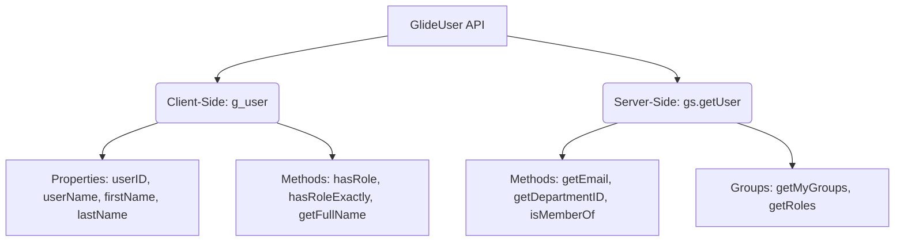

# ServiceNow GlideUser Deep Dive Reference Guide

The **GlideUser** API is used to retrieve information about the currently logged-in user. In ServiceNow, you access GlideUser differently depending on whether your script is running on the client side (browser) or the server side (cloud instance).

---

## 1. Client-Side vs. Server-Side User Objects



* **Client-Side (`g_user`):** A pre-instantiated global object available in all Client Scripts, UI Policies, and Service Portal widgets. It is designed to run fast without hitting the database.
* **Server-Side (`gs.getUser()`):** Retrieved using the GlideSystem helper `gs.getUser()`. It accesses the full database profile of the user and is used in Business Rules, Script Includes, ACLs, and Workflow scripts.

---

## 2. Client-Side GlideUser (`g_user`)

The `g_user` object provides properties and methods that describe the user currently viewing the page.

### A. Properties
* **`g_user.userID`**: The unique Sys ID (`sys_id`) of the logged-in user. (String)
* **`g_user.userName`**: The login username (e.g. `admin`, `rupam.user`). (String)
* **`g_user.firstName`**: The first name of the user. (String)
* **`g_user.lastName`**: The last name of the user. (String)

```javascript
// Example: Output properties to console
jslog("Logged in User Sys ID: " + g_user.userID);
jslog("Username: " + g_user.userName);
jslog("First Name: " + g_user.firstName);
```

---

### B. Methods

#### 1. `g_user.getFullName()`
* **Description:** Combines first and last name into a single string.
* **Example:**
```javascript
// Display a greeting on form load
function onLoad() {
    var fullName = g_user.getFullName();
    g_form.addInfoMessage("Hello " + fullName + "! Please update your ticket details.");
}
```

#### 2. `g_user.hasRole(roleName)`
* **Description:** Returns `true` if the logged-in user has the specified role, **OR if they have the `admin` role**.
* **Example:**
```javascript
// Show a field only if the user is an ITIL agent or Admin
if (g_user.hasRole('itil')) {
    g_form.setDisplay('u_internal_work_notes', true);
}
```

#### 3. `g_user.hasRoleExactly(roleName)`
* **Description:** Returns `true` **only** if the logged-in user has that exact role assigned to them. If the user is an `admin` but doesn't have this specific role explicitly, it returns `false`.
* **Example:**
```javascript
// Only users explicitly assigned security_admin (Admins don't get bypass automatically)
if (g_user.hasRoleExactly('security_admin')) {
    g_form.setReadOnly('u_secure_token', false);
} else {
    g_form.setReadOnly('u_secure_token', true);
}
```

#### 4. `g_user.hasRoles()`
* **Description:** Returns `true` if the logged-in user has any roles assigned to them (excluding the default `public` role).
* **Example:**
```javascript
// Show extra options if user is a licensed ServiceNow agent
if (g_user.hasRoles()) {
    g_form.setSectionDisplay('agent_workspace_options', true);
}
```

#### 5. `g_user.hasRoleFromList(rolesList)`
* **Description:** Returns `true` if the user has at least one of the roles in a comma-separated list.
* **Example:**
```javascript
// Check if user belongs to any fulfillment role
if (g_user.hasRoleFromList('itil, catalog_admin, asset')) {
    g_form.addInfoMessage("You are authorized to fulfill this request.");
}
```

---

## 3. Server-Side GlideUser (`gs.getUser()`)

On the server, you retrieve the current user object by calling `gs.getUser()`. This object contains much richer data than the client-side equivalent because it can access the database.

### A. Core Methods

#### 1. Profile Retrieval Methods
* **`gs.getUserID()`**: (Shorthand) Returns the Sys ID of the current user.
* **`gs.getUserName()`**: (Shorthand) Returns the username of the current user.
* **`gs.getUser().getDisplayName()`**: Returns the full display name of the user.
* **`gs.getUser().getEmail()`**: Returns the user's email address.
* **`gs.getUser().getDepartmentID()`**: Returns the Sys ID of the user's department.
* **`gs.getUser().getCompanyID()`**: Returns the Sys ID of the user's company.
* **`gs.getUser().getManagerID()`**: Returns the Sys ID of the user's manager.

```javascript
// Example: Get user details inside a Business Rule
var currentUser = gs.getUser();
gs.info("User Display Name: " + currentUser.getDisplayName());
gs.info("User Email: " + currentUser.getEmail());
gs.info("User Department SysID: " + currentUser.getDepartmentID());
```

#### 2. `gs.getUser().isMemberOf(group)`
* **Description:** Returns `true` if the current user is a member of the specified group. You can pass either the **Group Name** (string) or the **Group Sys ID**.
* **Example:**
```javascript
// Business Rule: Auto-assign ticket to service desk if user belongs to the group
if (gs.getUser().isMemberOf('Service Desk')) {
    current.setValue('assignment_group', 'sys_id_of_service_desk');
}
```

#### 3. `gs.getUser().getMyGroups()`
* **Description:** Returns a Java `ArrayList` containing the Sys IDs of all groups the current user belongs to.
* **Example:**
```javascript
// Query incidents assigned to any group the current logged-in user belongs to
var groups = gs.getUser().getMyGroups(); // Returns array of group sys_ids

var incGR = new GlideRecord('incident');
incGR.addQuery('assignment_group', 'IN', groups);
incGR.query();
while (incGR.next()) {
    gs.info("Incident assigned to my group: " + incGR.getValue('number'));
}
```

#### 4. `gs.getUser().getRoles()`
* **Description:** Returns a Java `ArrayList` containing all roles assigned to the current user.
* **Example:**
```javascript
var rolesList = gs.getUser().getRoles();
gs.info("User Roles: " + rolesList.toString()); 
// Output: [itil, catalog_admin, template_editor]
```

---

## 4. Key Differences Cheat Sheet

| Feature | Client-Side (`g_user`) | Server-Side (`gs.getUser()`) |
| :--- | :--- | :--- |
| **Bypass Admin check**| `hasRoleExactly('role')` | Must query manually or parse roles list. |
| **Email Retrieval** | No property. Must use GlideAjax. | `gs.getUser().getEmail()` |
| **Group Check** | Not supported. Must use GlideAjax. | `gs.getUser().isMemberOf('Group Name')` |
| **All My Groups** | Not supported. Must use GlideAjax. | `gs.getUser().getMyGroups()` |
| **User Department** | Not supported. Must use GlideAjax. | `gs.getUser().getDepartmentID()` |

---

## 5. Security Warning: The Client-Side Fallacy

> [!WARNING]  
> **Never rely on `g_user` for security or data protection.**
> 
> Client-side scripts run inside the user's browser, meaning a tech-savvy user can press `F12`, go to the Console, and run `g_form.setDisplay('restricted_field', true)` or bypass your client-side `hasRole()` checks.
> 
> **The Golden Rule of ServiceNow Development:**
> * Use **Client Scripts & UI Policies (`g_user`)** to make the form look nice, user-friendly, and interactive (e.g. hiding tabs or showing warnings).
> * Use **Access Control Lists (ACLs) and Business Rules (`gs.getUser()`)** to enforce database security. If a user tries to modify a field they don't have roles for, the server must reject the save!
