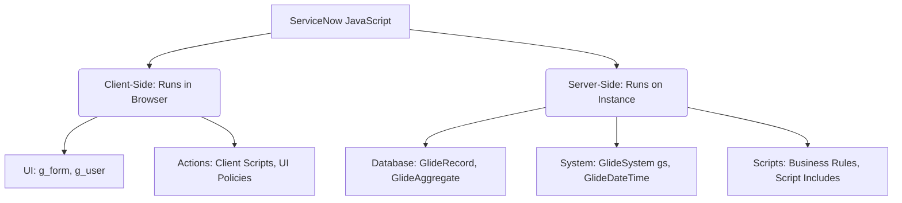

# Master ServiceNow JavaScript: Scratch to Advanced Reference Guide

This guide is designed to take you from a complete beginner in JavaScript to an advanced developer within the ServiceNow ecosystem. 

---

## 1. The ServiceNow JavaScript Environments

ServiceNow runs JavaScript in two separate places: the **Client** (user's browser) and the **Server** (ServiceNow instance cloud).



### Key Differences
| Feature | Client-Side JS | Server-Side JS |
| :--- | :--- | :--- |
| **Where it runs** | User's Web Browser (Chrome, Safari, etc.) | ServiceNow Cloud Server (Mozilla Rhino engine) |
| **Main Purpose** | UI interactions, validation, showing/hiding fields. | Database queries, calculations, security, integrations. |
| **Key APIs** | `g_form`, `g_user`, `GlideAjax` | `GlideRecord`, `gs` (GlideSystem), `GlideDateTime` |
| **Performance Impact**| High impact on user experience (freezing screen if slow). | High impact on database load (slow database queries). |

---

## 2. JavaScript Language Fundamentals (Detailed)

Here is a deep dive into every core JavaScript concept you must know, complete with examples and detailed explanations.

---

### A. Variables & Declarations
Variables are containers that store data values in memory. JavaScript provides three ways to declare them, each with different scoping rules:

#### 1. `var`
* **Explanation:** Historically the default variable declaration. It is **function-scoped**, meaning it is accessible anywhere inside the function it is defined in, even before it is declared (a concept called hoisting). It does not respect block scoping (like inside `if` statements or `for` loops).
* **Example:**
```javascript
function testVar() {
    if (true) {
        var x = 10; // Declared inside an 'if' block
    }
    gs.info(x); // Works! x is accessible here because var ignores block scope
}
```

#### 2. `let`
* **Explanation:** Introduced in ES6, `let` is **block-scoped**. It is only accessible within the exact curly braces `{}` it is defined in. This prevents bugs caused by variables leaking outside of loops or conditions. It can be reassigned.
* **Example:**
```javascript
function testLet() {
    if (true) {
        let y = 20; // Block-scoped
    }
    // gs.info(y); // ERROR! y is not defined here
}
```

#### 3. `const`
* **Explanation:** Also block-scoped. Unlike `let`, a `const` variable is **read-only**. Once you assign a value to a `const` variable, you cannot reassign it. Use this for configurations, table names, or references that must remain constant.
* **Example:**
```javascript
const tableName = "incident";
// tableName = "change_request"; // ERROR! Assignment to constant variable.
```

---

### B. JavaScript Data Types
JavaScript variables dynamically hold values of different data types.

#### 1. String
* **Explanation:** Textual data wrapped in single (`'`) or double (`"`) quotes.
* **Example:** `var userName = "Rupam User";`

#### 2. Number
* **Explanation:** Numeric values. JavaScript doesn't distinguish between integers and floating-point decimals; both are simply Numbers.
* **Example:** `var limit = 50; var price = 99.99;`

#### 3. Boolean
* **Explanation:** Represents a logical value that can only be `true` or `false`. Highly used for flags and conditionals.
* **Example:** `var isActive = true;`

#### 4. Null
* **Explanation:** Represents an intentional absence of any value. It points to "nothing".
* **Example:** `var emptyField = null; // Field is intentionally cleared`

#### 5. Undefined
* **Explanation:** Occurs when a variable has been declared but has not yet been assigned a value.
* **Example:**
```javascript
var unassignedVar;
gs.info(unassignedVar); // Prints 'undefined'
```

#### 6. Object
* **Explanation:** A complex data type containing key-value pairs inside curly braces `{}`. Used to store structured data.
* **Example:**
```javascript
var incidentInfo = {
    number: "INC0001",
    priority: 1,
    active: true
};
gs.info(incidentInfo.number); // Access property: "INC0001"
```

#### 7. Array
* **Explanation:** An ordered list of values enclosed in square brackets `[]`. Each item has a numeric index starting at `0`.
* **Example:**
```javascript
var categoryList = ["Hardware", "Software", "Network"];
gs.info(categoryList[0]); // Access first element: "Hardware"
```

---

### C. Standard Operators

#### 1. Arithmetic Operators
* **Explanation:** Used to perform mathematical calculations.
  * `+` (Addition or text concatenation)
  * `-` (Subtraction)
  * `*` (Multiplication)
  * `/` (Division)
  * `%` (Modulus: returns the remainder of a division)
* **Example:**
```javascript
var sum = 10 + 5;      // 15
var remainder = 10 % 3; // 1 (10 divided by 3 is 3 with a remainder of 1)
var message = "INC: " + 909; // Concatenation: "INC: 909"
```

#### 2. Assignment Operators
* **Explanation:** Assigns values to variables. Shorthands combine arithmetic with assignment.
  * `=` (Standard assign)
  * `+=` (Add and assign)
  * `-=` (Subtract and assign)
* **Example:**
```javascript
var count = 5;
count += 2; // Equivalent to: count = count + 2; (count becomes 7)
```

#### 3. Comparison Operators
* **Explanation:** Compares two values and returns a Boolean (`true` or `false`).
  * `==` (Equal to: compares value only, converting types if necessary)
  * `===` (Strict equal to: compares value AND data type)
  * `!=` (Not equal to)
  * `!==` (Strict not equal to)
  * `>`, `<`, `>=`, `<=` (Greater than, less than, or equal to)
* **Example:**
```javascript
5 == "5";  // true (type coercion converts string to number)
5 === "5"; // false (different types: number vs string)
```

#### 4. Logical Operators
* **Explanation:** Determines the logic between variables.
  * `&&` (Logical AND: returns true if both expressions are true)
  * `||` (Logical OR: returns true if at least one expression is true)
  * `!` (Logical NOT: reverses the boolean value)
* **Example:**
```javascript
var isP1 = true;
var isActive = false;
var result = isP1 && isActive; // false (both must be true)
var opposite = !isP1;          // false
```

---

### D. Crucial String Methods

#### 1. `indexOf(substring)`
* **Explanation:** Searches the string for a substring and returns the starting index position (0-indexed). Returns `-1` if the text is not found.
* **Example:**
```javascript
var text = "ServiceNow Platform";
var pos = text.indexOf("Platform"); // returns 11
var missing = text.indexOf("Rhino"); // returns -1
```

#### 2. `includes(substring)`
* **Explanation:** Returns `true` if the string contains the specified substring, and `false` if it does not.
* **Example:**
```javascript
var email = "user@servicenow.com";
var isSNOwned = email.includes("servicenow.com"); // returns true
```

#### 3. `toLowerCase()` / `toUpperCase()`
* **Explanation:** Converts all characters in a string to lowercase or uppercase. Extremely useful for comparing user-typed strings.
* **Example:**
```javascript
var state = "Closed";
var cleanState = state.toLowerCase(); // "closed"
```

#### 4. `split(separator)`
* **Explanation:** Splits a string into an array of smaller strings using a specified divider character.
* **Example:**
```javascript
var csv = "Incident,Problem,Change";
var list = csv.split(","); // returns Array: ["Incident", "Problem", "Change"]
```

#### 5. `replace(search, replacement)`
* **Explanation:** Searches for a specific piece of text and replaces it with another.
* **Example:**
```javascript
var summary = "Error in database";
var fixed = summary.replace("Error", "Warning"); // "Warning in database"
```

#### 6. `trim()`
* **Explanation:** Removes whitespace (spaces, tabs, newlines) from both the beginning and end of a string.
* **Example:**
```javascript
var input = "   INC00102   ";
var cleanInput = input.trim(); // "INC00102"
```

#### 7. `substring(start, end)`
* **Explanation:** Extracts characters from a string between two specified index numbers. The `end` index is exclusive.
* **Example:**
```javascript
var ticket = "INC0005432";
var numberPart = ticket.substring(3, 10); // extracts index 3 to 9: "0005432"
```

---

### E. Crucial Array Methods

#### 1. `push(item)`
* **Explanation:** Adds one or more elements to the **end** of an array and returns the new length of the array.
* **Example:**
```javascript
var states = ["New", "In Progress"];
states.push("On Hold"); // states is now: ["New", "In Progress", "On Hold"]
```

#### 2. `pop()`
* **Explanation:** Removes the **last** element from an array and returns that element.
* **Example:**
```javascript
var list = [1, 2, 3];
var lastItem = list.pop(); // lastItem is 3, list is now: [1, 2]
```

#### 3. `shift()`
* **Explanation:** Removes the **first** element from an array and returns it, shifting all other elements down one index.
* **Example:**
```javascript
var list = ["First", "Second", "Third"];
var firstItem = list.shift(); // firstItem is "First", list is now: ["Second", "Third"]
```

#### 4. `unshift(item)`
* **Explanation:** Adds one or more elements to the **beginning** of an array and shifts older items up.
* **Example:**
```javascript
var list = [2, 3];
list.unshift(1); // list is now: [1, 2, 3]
```

#### 5. `indexOf(item)`
* **Explanation:** Searches the array for a specific element and returns its index position. Returns `-1` if the item is not present.
* **Example:**
```javascript
var roles = ["admin", "itil", "user"];
var index = roles.indexOf("itil"); // returns 1
```

#### 6. `join(separator)`
* **Explanation:** Combines all items in an array into a single string, separated by the character specified.
* **Example:**
```javascript
var pieces = ["INC001", "P1", "Active"];
var str = pieces.join(" | "); // "INC001 | P1 | Active"
```

#### 7. `forEach(callback)`
* **Explanation:** Executes a provided function once for each item in the array. Great for iterating through list items.
* **Example:**
```javascript
var users = ["Rupam", "John", "Alice"];
users.forEach(function(user) {
    gs.info("Hello " + user);
});
```

#### 8. `filter(callback)`
* **Explanation:** Creates a new array filled with all elements that pass a test defined by a helper function.
* **Example:**
```javascript
var priorities = [1, 2, 3, 4, 5];
var criticalPriorities = priorities.filter(function(p) {
    return p <= 2; // keep elements less than or equal to 2
}); // returns: [1, 2]
```

---

### F. Conditions (Control Flow)
Control flow structures execute different branches of code based on logical conditions.

#### 1. `if / else if / else`
* **Explanation:** Evaluates a conditional expression inside parenthesis. If it is true, the following block runs. If false, it checks the next branch.
* **Example:**
```javascript
var priority = 1;
if (priority === 1) {
    gs.info("Critical Action Required!");
} else if (priority === 2) {
    gs.info("High Action Required.");
} else {
    gs.info("Standard handling.");
}
```

#### 2. `switch`
* **Explanation:** Evaluates an expression, matching its value to a series of `case` clauses. When a match is found, code executes until a `break` keyword is hit. Good for replacing long chains of `if/else`.
* **Example:**
```javascript
var category = "software";
switch (category) {
    case "hardware":
        gs.info("Dispatch field agent.");
        break;
    case "software":
        gs.info("Assign to systems team.");
        break;
    default:
        gs.info("Assign to general service desk.");
}
```

#### 3. Ternary Operator (`? :`)
* **Explanation:** The only JavaScript operator that takes three operands. It serves as a single-line conditional shorthand for simple `if/else` assignments: `condition ? value_if_true : value_if_false`.
* **Example:**
```javascript
var urgency = 1;
var isCritical = (urgency === 1) ? "Yes" : "No"; // isCritical becomes "Yes"
```

---

### G. Loops
Loops are used to execute a block of code repeatedly.

#### 1. `while`
* **Explanation:** Loops through a block of code as long as a specified condition remains true. **Crucial in ServiceNow database processing.**
* **Example:**
```javascript
var counter = 0;
while (counter < 3) {
    gs.info("Counter: " + counter);
    counter++; // Always increment to prevent infinite loops!
}
```

#### 2. `for`
* **Explanation:** Loops through a block of code a specific number of times. It includes three parts: initialization, conditional test, and incremental update.
* **Example:**
```javascript
// Prints numbers from 1 to 3
for (var i = 1; i <= 3; i++) {
    gs.info("Iteration: " + i);
}
```

#### 3. `for...in`
* **Explanation:** Iterates over all enumerable properties (keys) of an **object**.
* **Example:**
```javascript
var user = { name: "Rupam", role: "admin" };
for (var key in user) {
    gs.info(key + " = " + user[key]); // Prints "name = Rupam", then "role = admin"
}
```

#### 4. `for...of`
* **Explanation:** Iterates over the values of an iterable structure, such as an **array**.
* **Example:**
```javascript
var colors = ["red", "blue"];
for (var color of colors) {
    gs.info("Color: " + color); // Prints "Color: red", then "Color: blue"
}
```

---

### H. Functions
Functions are self-contained blocks of code designed to perform specific operations, helping you write cleaner, modular code.

#### 1. Function Declaration
* **Explanation:** Defines a named function that can be called anywhere in your scope (even before it appears in the code, due to hoisting).
* **Example:**
```javascript
function greetUser(firstName) {
    return "Welcome, " + firstName + "!";
}
var greeting = greetUser("Rupam"); // "Welcome, Rupam!"
```

#### 2. Function Expression
* **Explanation:** A function defined inside an expression (often saved into a variable). It is not hoisted, meaning you can only call it after it has been defined.
* **Example:**
```javascript
var calculateTotal = function(qty, price) {
    return qty * price;
};
var total = calculateTotal(2, 50); // 100
```

#### 3. Callback Functions
* **Explanation:** A function passed as an argument into another function. This passed function is then called (executed) inside the outer function at a later stage. Highly used in asynchronous operations like **GlideAjax**.
* **Example:**
```javascript
function performTask(callback) {
    gs.info("Task starting...");
    // Task finishes
    callback("Completed successfully!");
}

// Call the function and pass an anonymous function as the callback
performTask(function(statusMessage) {
    gs.info("Result: " + statusMessage);
});
```

---

## 3. Server-Side ServiceNow JavaScript (The "Glide" APIs)

Server-side scripts (Business Rules, Script Includes, Scheduled Jobs) talk directly to the database using ServiceNow's **Glide APIs**.

### A. `GlideRecord` (CRUD Database Queries)
`GlideRecord` is used to Create, Read, Update, and Delete records in database tables.

#### 1. Querying Records (Read)
Always follow the **"Query Blueprint"**:
1. Initialize the table.
2. Add filters (queries).
3. Execute query.
4. Loop through results.

```javascript
var incidentGR = new GlideRecord('incident'); // 1. Set Table
incidentGR.addQuery('active', true);          // 2. Add Filter: Active is True
incidentGR.addQuery('priority', 1);           //    Add Filter: Priority is Critical
incidentGR.query();                           // 3. Run query

// 4. Loop through matching records
while (incidentGR.next()) {
    gs.info('Found active P1 incident: ' + incidentGR.getValue('number'));
}
```

#### 2. Creating a Record (Create)
```javascript
var newIncident = new GlideRecord('incident');
newIncident.initialize(); // Set default values
newIncident.setValue('short_description', 'Database connection issue');
newIncident.setValue('urgency', 1);
var newSysId = newIncident.insert(); // Inserts to database and returns sys_id
gs.info('Created new incident with sys_id: ' + newSysId);
```

#### 3. Updating Records (Update)
```javascript
var updateGR = new GlideRecord('incident');
if (updateGR.get('sys_id_here')) { // Find a single record by its sys_id
    updateGR.setValue('state', 7); // Set state to Closed
    updateGR.setValue('close_notes', 'Resolved via script update.');
    updateGR.update(); // Save changes to the database
}
```

---

### B. `GlideAggregate` (Efficient Database Counting/Summaries)
Never use `GlideRecord` just to count records. It loads all record data into memory. Use `GlideAggregate` instead, which runs SQL calculations directly in the database.

```javascript
// WRONG WAY (Slow, bad memory usage):
var countGR = new GlideRecord('incident');
countGR.addQuery('active', true);
countGR.query();
gs.info('Active Incidents: ' + countGR.getRowCount());

// CORRECT WAY (Fast, lightweight):
var agg = new GlideAggregate('incident');
agg.addQuery('active', true);
agg.addAggregate('COUNT');
agg.query();
var activeCount = 0;
if (agg.next()) {
    activeCount = agg.getAggregate('COUNT');
}
gs.info('Active Incidents: ' + activeCount);
```

---

### C. `GlideSystem (gs)` (System Utility Class)
The `gs` object provides system metrics, user roles, logs, and properties.

```javascript
// 1. Logging (Always use for debugging server scripts)
gs.info('This is an info log');
gs.warn('This is a warning log');
gs.error('This is an error log');

// 2. Getting User Info
var currentUserID = gs.getUserID(); // Returns sys_id of logged-in user
var currentUserName = gs.getUserName(); // Returns username (e.g., admin)
var isITILUser = gs.hasRole('itil'); // Returns true/false

// 3. System Properties
var maxRecords = gs.getProperty('my.custom.max_records', '10');
```

---

### D. `GlideDateTime` (Date/Time Operations)
ServiceNow stores dates/times in UTC format. Use `GlideDateTime` to handle timezone conversions and additions.

```javascript
// Get current date/time
var gdt = new GlideDateTime(); 
gs.info('UTC Time: ' + gdt.getValue()); 

// Add 5 days
gdt.addDaysLocalTime(5);
gs.info('In 5 days: ' + gdt.getDisplayValue()); // Local timezone format

// Compare two dates
var date1 = new GlideDateTime("2026-05-30 12:00:00");
var date2 = new GlideDateTime("2026-06-15 12:00:00");
var diffSeconds = gs.dateDiff(date1, date2, true); // Returns seconds difference
```

---

## 4. Client-Side ServiceNow JavaScript (The Form APIs)

Client scripts run inside the user's browser tab. You manipulate the UI dynamically using client APIs.

### A. `g_form` (GlideForm)
Used to control fields, sections, and values on a form layout.

```javascript
// 1. Set and get values
var shortDesc = g_form.getValue('short_description');
g_form.setValue('short_description', 'Updated: ' + shortDesc);

// 2. Control field visibility & properties
g_form.setDisplay('assigned_to', false); // Hides field and space
g_form.setMandatory('work_notes', true); // Makes field mandatory
g_form.setReadOnly('priority', true);    // Prevents changes to priority

// 3. Messages on the form
g_form.addInfoMessage('Please check assignment fields before saving.');
g_form.showFieldMsg('assigned_to', 'Verify if this user is active', 'error');
```

### B. `g_user` (GlideUser)
Used to retrieve details about the currently logged-in user without running a server script.

```javascript
// Check roles directly
if (g_user.hasRole('itil')) {
    g_form.addInfoMessage('Welcome to the ITIL workspace, ' + g_user.firstName);
}

// Get User ID and Name
var userId = g_user.userID; 
var fullName = g_user.getFullName();
```

---

## 5. Advanced ServiceNow JavaScript: Script Includes (OOP)

Script Includes are reusable, Object-Oriented JS classes on the ServiceNow server. They allow you to write a script once and call it from anywhere (Business Rules, client scripts, etc.).

### Blueprint of a Class:
```javascript
// Name of Script Include must match the Class Name exactly!
var IncidentUtils = Class.create();
IncidentUtils.prototype = {
    initialize: function() {
        // Constructor: Runs whenever 'new IncidentUtils()' is called
    },

    isAssignedToActiveUser: function(incidentGR) {
        var assignedTo = incidentGR.getValue('assigned_to');
        if (!assignedTo) {
            return false;
        }

        var userGR = new GlideRecord('sys_user');
        if (userGR.get(assignedTo)) {
            return userGR.getValue('active') == '1';
        }
        return false;
    },

    type: 'IncidentUtils'
};
```

#### How to trigger this class in a Business Rule:
```javascript
var utils = new IncidentUtils();
var isActive = utils.isAssignedToActiveUser(current);
if (!isActive) {
    gs.addErrorMessage('Warning: Assigned user is inactive!');
}
```

---

## 6. ServiceNow Performance & Best Practices

1. **Avoid GlideRecord in Client Scripts:** Never use `new GlideRecord()` in a client script. It executes synchronous database queries that freeze the browser. Use `GlideAjax` instead.
2. **Never query database in loops:**
   ```javascript
   // BAD WAY (N+1 Query Issue - creates thousands of database hits)
   while (incidentGR.next()) {
       var userGR = new GlideRecord('sys_user');
       userGR.get(incidentGR.getValue('assigned_to'));
   }

   // GOOD WAY
   // Use addQuery('sys_id', 'IN', listOfIds) or joins to query once!
   ```
3. **Use `setLimit()` for safety:** When querying open tables, if you only need the first few records, limit your queries:
   ```javascript
   var gr = new GlideRecord('syslog');
   gr.addQuery('level', 2);
   gr.setLimit(100); // Prevents loading millions of log rows
   gr.query();
   ```
4. **Use JSON for data structures:** Instead of parsing custom strings like `"Val1|Val2|Val3"`, construct objects and use standard JSON methods:
   * `JSON.stringify(object)` (converts object -> string)
   * `JSON.parse(string)` (converts string -> object)
